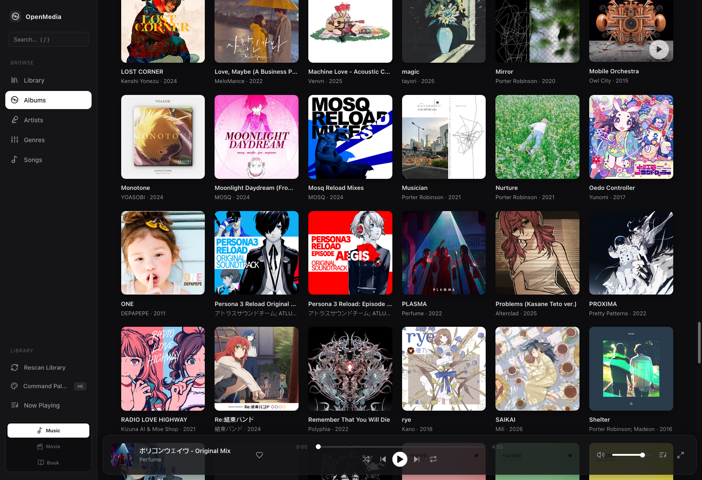
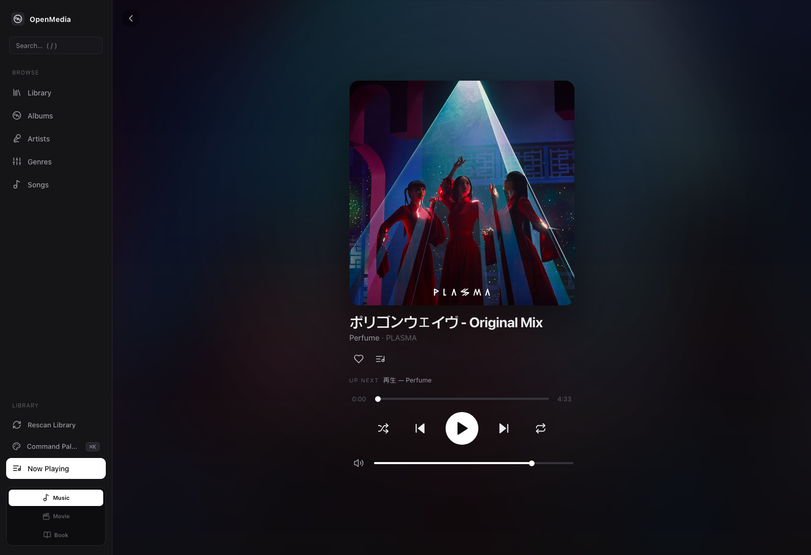
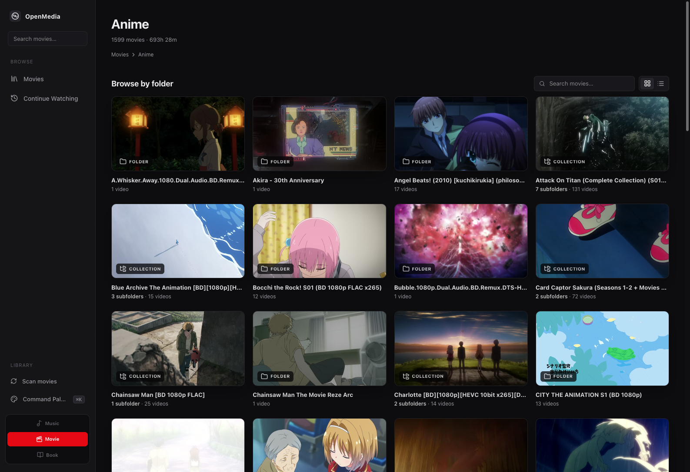
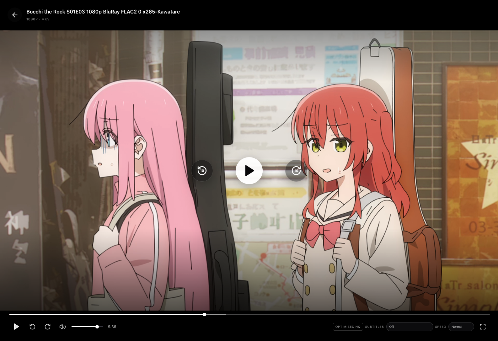
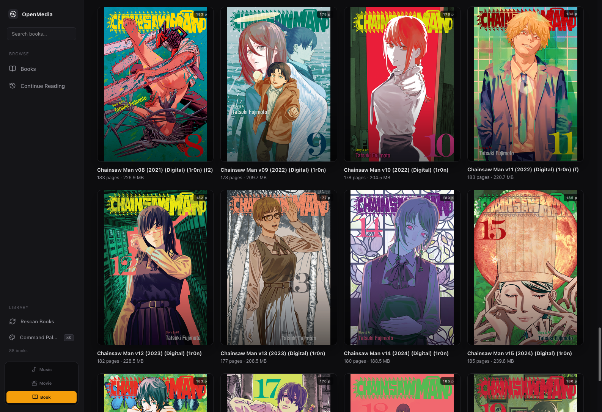
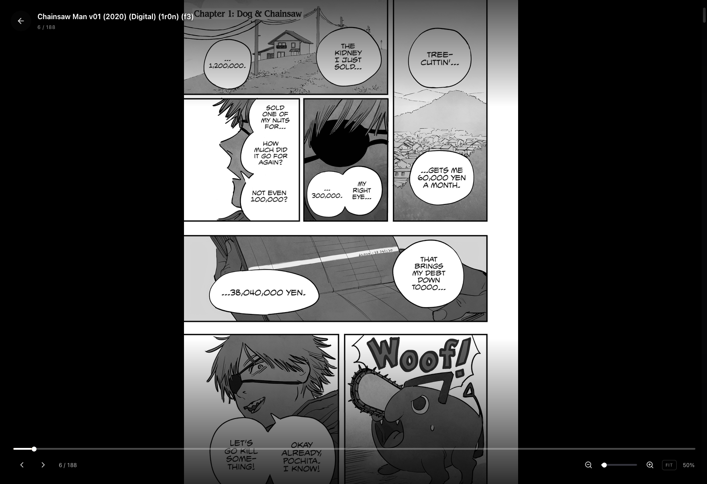

# OpenMedia

**Your drives. Your media. A private player that actually feels good to use.**

OpenMedia is a self-hosted, browser-based player for the music, movies, and
books you've already got on your computer. Point it at a folder, open the
browser, and that's it — no account, no login, no cloud, no subscription. The
app reads your files, builds a local search index, and plays them in a dark,
keyboard-friendly interface.

It's built for **one person on one machine** who wants their library back under
their own roof.

---

## 📸 Screenshots

### 🎵 Music





### 🎬 Movies





### 📚 Books





---

## What it does

At a glance: OpenMedia turns three folders (one for music, one for movies, one
for books) into a single, fast, searchable player.

- **No accounts.** No login screen, no signup, no "sign in with Google." Your
  preferences live in your own browser. Nothing is sent anywhere.
- **Local-first.** Files stay on your drive. The server reads them; the browser
  streams them. There is no third party in the loop.
- **Searchable library.** Once it scans your folder, everything — tracks,
  albums, artists, genres, movies, books — is one search away. Open the command
  palette with `⌘K` / `Ctrl+K` and start typing.
- **Smart video.** MP4 plays directly. MKV, AVI, HEVC, weird audio — OpenMedia
  spins up a quick FFmpeg session in the background and serves the result as
  HLS so it works in any modern browser.
- **Resume where you stopped.** Movies remember their position. The "Continue
  Watching" row picks up exactly where you left off.

---

## ✨ Features

### Music
- Scans a folder recursively for `mp3`, `flac`, `wav`, `m4a`, `aac`, `ogg`,
  `opus` (and any extras you want to add).
- Reads embedded metadata: title, artist, album, album artist, genre, year,
  duration, track/disc number, and cover art.
- Browses by **Library**, **Albums**, **Artists**, **Genres**, and **Songs**.
- Album and artist detail pages.
- A bottom-bar player with play/pause, next/previous, seek, volume, shuffle,
  and repeat (off / all / one).
- A slide-out **Queue** panel and a full **Now Playing** view.
- `⌘K` / `Ctrl+K` command palette.
- Media Session API: hardware media keys and OS media controls just work.

### Movies
- Scans a folder for `mp4`, `m4v`, `mkv`, and `avi`.
- MP4 / M4V with H.264 plays natively with instant seek.
- MKV, AVI, HEVC, and other oddities get on-the-fly HLS transcoding so they
  play in the browser anyway.
- Hardware H.264 encoding on macOS via VideoToolbox; software `libx264`
  fallback everywhere else.
- Multi-audio-track selection for movies that ship with several languages.
- Text subtitles (SRT, ASS, WebVTT, mov_text) work; image-based ones (PGS) don't.
- Lazy thumbnails, resume progress, "Continue Watching".

### Books
- Browse a folder of books in a clean library view.
- Open any book in a built-in reader.

### Everywhere
- Keyboard shortcuts everywhere (see below).
- Installable as a **PWA** — pop it on the dock / taskbar like a native app.
- Light / dark UI honoring your system preference.
- All preferences stored locally: volume, shuffle, repeat, queue, recently
  played, favorites. **No server-side accounts.**

---

## 🧱 Architecture

If you're just here to run it, **skip this section.** Below is a quick map of
the code if you want to poke around or contribute.

```
OpenMedia-v2/
├── package.json            # npm workspaces (server + client)
├── .env / .env.example     # your music folder, port, db path
│
├── server/                 # Node + Express + TypeScript backend
│   └── src/
│       ├── config.ts       # reads .env, validates
│       ├── paths.ts        # anti-traversal guard for streams/covers
│       ├── db.ts           # SQLite schema + queries
│       ├── metadata.ts     # parses music files into track rows
│       ├── scanner.ts      # walk the folder, pick up new/deleted files
│       ├── stream.ts       # HTTP Range audio streaming
│       ├── routes.ts       # every /api/* endpoint
│       └── index.ts        # Express app entry point
│
└── client/                 # React + Vite + TypeScript frontend
    └── src/
        ├── api.ts          # tiny typed fetch client
        ├── stores/         # zustand: player, library, UI
        ├── hooks/          # keyboard, media session
        ├── components/     # Player, Queue, CommandPalette, lists, grids…
        └── pages/          # Library, Albums, Artists, Search, NowPlaying…
```

**Why this shape?**

- **React + Vite + TypeScript** on the front so pages are easy to keep up to
  date and the compiler catches bugs at write-time.
- **Express + SQLite** on the back because for one user, one machine, that's
  plenty of power and zero ops.
- **State lives in zustand**, persisted to `localStorage`. Simple, fast,
  no boilerplate.
- **Security:** the browser only ever asks for a track by its ID (a SHA-1 of
  the file path). It can never ask "give me `/etc/passwd`" — there is no path
  the server will trust.

---

## 🚀 Quick start

You'll need: **Node.js 20+**, **npm**, and **`ffmpeg`** + **`ffprobe`**
(installed once on your system; required for movie transcoding and ALAC).

### 1. Install

```bash
npm install
```

### 2. Tell OpenMedia where your stuff lives

Copy the example env file and edit it:

```bash
cp .env.example .env
```

Open `.env` and point the paths at your folders:

```bash
MUSIC_LIBRARY_PATH=/path/to/your/music
MOVIE_LIBRARY_PATH=/path/to/your/movies
BOOK_LIBRARY_PATH=/path/to/your/books
```

Folders are scanned recursively. Anything in there becomes part of the
library. Example music layout:

```
/path/to/your/music
├── Daft Punk/
│   └── Discovery/
│       ├── 01 - One More Time.flac
│       └── 02 - Aerodynamic.flac
└── Radiohead/
    └── OK Computer/
        └── 01 - Airbag.mp3
```

### 3. Run it

```bash
npm run dev
```

Open <http://localhost:5173> and you're in.

On first launch, if the library is empty the backend **scans automatically**
so you don't have to wait. After that, the cache makes startup instant. Hit
**"Rescan Library"** in the sidebar any time you add new files.

**Want to use it from your phone on the same Wi-Fi?** Set `APP_HOST=0.0.0.0`,
restart `npm run dev`, and open `http://<this-machine's-LAN-IP>:5173`. Only do
this on a network you trust — there is no login.

---

## ⚙️ Configuration

Everything lives in `.env` at the repo root.

| Variable | Default | What it does |
|---|---|---|
| `MUSIC_LIBRARY_PATH` | `./music` | Folder scanned recursively for audio. **Set this to your music.** |
| `MOVIE_LIBRARY_PATH` | _(unset)_ | Optional folder scanned for `mp4`, `m4v`, `mkv`, `avi` movies. |
| `BOOK_LIBRARY_PATH` | _(unset)_ | Optional folder scanned for books. |
| `APP_PORT` | `3000` | Backend API port (and the production SPA in single-port mode). |
| `APP_HOST` | `127.0.0.1` | Interface to bind. Use `0.0.0.0` **only** for intentional LAN access. |
| `DATABASE_PATH` | `./data/library.db` | Where the SQLite metadata cache is stored. |
| `EXTRA_AUDIO_EXTENSIONS` | _(empty)_ | Comma-separated extras, e.g. `aif,m4b,caf`. |
| `LOG_LEVEL` | `info` | One of `debug`, `info`, `warn`, `error`. |

---

## ⌨️ Keyboard shortcuts

| Shortcut | Action |
|---|---|
| `Space` | Play / Pause |
| `←` / `→` | Seek −/+ 10 seconds |
| `Shift` + `←` / `→` | Previous / Next track |
| `↑` / `↓` | Volume up / down |
| `M` | Mute / Unmute |
| `S` | Toggle shuffle |
| `R` | Cycle repeat (off → all → one) |
| `Q` | Toggle queue panel |
| `/` | Focus search |
| `Cmd` / `Ctrl` + `K` | Open command palette |
| `Esc` | Close panels / blur input |

Shortcuts are ignored while you're typing in an input.

---

## 🎵 Supported formats

Audio: `mp3`, `flac`, `wav`, `m4a`, `aac`, `ogg`, `opus` (plus `oga`, `weba`,
`wma` on a best-effort basis). Add rare formats with
`EXTRA_AUDIO_EXTENSIONS`. Music streams as its original bytes when the browser
supports them. ALAC audio inside `.m4a` is converted losslessly to FLAC on
first playback and cached under `data/transcodes` — no audio information is
discarded.

Movies: `mp4`, `m4v`, `mkv`, `avi`. See "What it does" above for how the
playback pipeline decides between direct play and HLS transcoding.

---

## 🔄 Scanning & rescanning

- Walks your music folder recursively, skipping hidden files.
- **Incremental:** a file is only re-parsed if its size or modification time
  changed. Subsequent rescans are fast.
- Files you've deleted are pruned from the cache automatically.
- Trigger a rescan any time:
  - In the app: **"Rescan Library"** in the sidebar (live progress).
  - Via API: `POST /api/rescan`, then poll `GET /api/scan/status`.

---

## 🌐 Production / single-port mode

Want one URL, no dev servers? Build the frontend once and let the backend
serve it:

```bash
npm run build      # builds client/ into client/dist
npm start          # runs the server; serves the SPA at / and the API at /api
```

Then open:

- `http://localhost:3000/music` — the music player
- `http://localhost:3000/movie` — the movie library
- `http://localhost:3000/book`  — the book library

The root URL redirects to music. By default the server binds to loopback
(127.0.0.1) because there is no login. For intentional LAN access, set
`APP_HOST=0.0.0.0` and protect the service with a trusted firewall or reverse
proxy.

> Note: in production the server runs via `tsx` — TypeScript is executed
> on-the-fly. This keeps the setup simple and is fine for personal self-hosted
> use.

---

## 🔌 API reference

All endpoints at `/api/*`. Public IDs are stable SHA-1 hashes — the browser
never asks for filesystem paths directly.

| Method & path | Description |
|---|---|
| `GET /api/health` | Liveness probe. |
| `GET /api/library/summary` | Counts of tracks/albums/artists/genres + total duration. |
| `GET /api/tracks` | List tracks. Query: `?sort=title\|artist\|album\|duration\|date_added&order=asc\|desc&page&limit&search&genre`. |
| `GET /api/albums` | List albums. `?sort=title\|artist\|year\|recently_added&order&page&limit&search`. |
| `GET /api/albums/recent` | Recently added albums (`?limit`). |
| `GET /api/albums/:id` | Album detail with ordered tracks. |
| `GET /api/artists` | List artists. `?order&page&limit&search`. |
| `GET /api/artists/:id` | Artist detail with albums + tracks. |
| `GET /api/genres` | All genres with track counts. |
| `GET /api/search?q=` | Search tracks / albums / artists. |
| `GET /api/stream/:id` | Stream audio (HTTP `Range` aware). |
| `GET /api/cover/:id` | Embedded cover art for a track. |
| `POST /api/rescan` | Trigger a rescan (async). |
| `GET /api/scan/status` | Current scan progress / last result. |

**Security:** every stream and cover request goes through `resolveWithin()`,
which rejects absolute paths and any `..` traversal outside
`MUSIC_LIBRARY_PATH`. The browser physically cannot request arbitrary files.

---

## 🧪 Development scripts

Run from the repo root:

```bash
npm run dev          # server + client (dev mode)
npm run build        # build client, typecheck server
npm start            # run production server (serves built client + API)
npm run typecheck    # TS check both workspaces
npm run lint         # ESLint both workspaces
npm test             # backend test suite (Vitest)
```

Per-workspace scripts work too: `npm run <script> -w server` or `-w client`.

The backend test suite covers the security-critical and behavior-critical
paths: secure path resolution (traversal prevention), HTTP Range parsing, key
determinism, SQLite aggregation & sort-key whitelisting, the full scanner
(incremental skip, pruning of deleted files), and the API end-to-end
(stream 206/200/404, cover bytes/404, rescan idempotency).

```bash
npm test
```

> The scanner/API integration tests generate tiny MP3s with `ffmpeg`, so the
> suite auto-skips those if `ffmpeg` isn't on your `PATH` (the pure-logic
> tests still run).

---

## ⚠️ Known limitations

- **Browser codec limits still apply.** Music streams as-is except for lossless
  ALAC→FLAC. Movies that the browser can't decode route through the HLS
  pipeline above.
- **No gapless playback** — the browser's `<audio>` element has a small gap
  between tracks.
- **One folder per library type.** Set `MUSIC_LIBRARY_PATH` to one root;
  subfolders are scanned automatically. (Symlinks inside the root are
  followed only if they resolve back inside the root.)
- **Single-user, local-first.** No accounts, sync, sharing, or cloud. Your
  preferences live in each browser's `localStorage`.
- **PWA icons are placeholders.** Replace `client/public/icon-{192,512}.png`
  with your own for a polished install experience.
- **Very large libraries** (tens of thousands of albums) may benefit from
  higher pagination limits or additional DB tuning, but defaults handle typical
  personal libraries comfortably.

---

## 📄 License

MIT.
